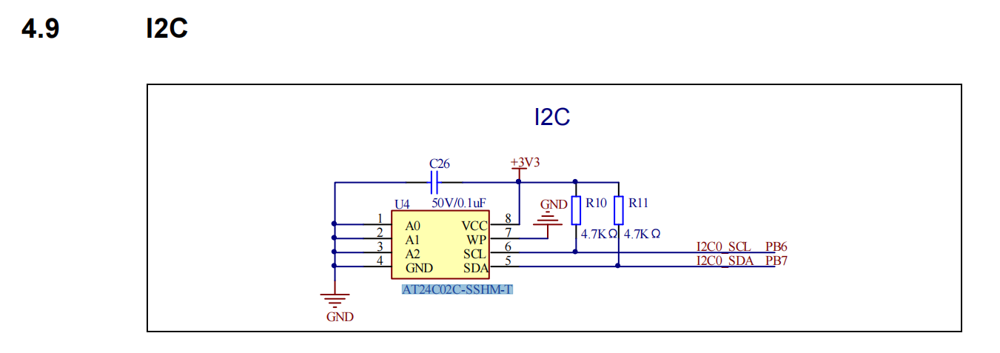
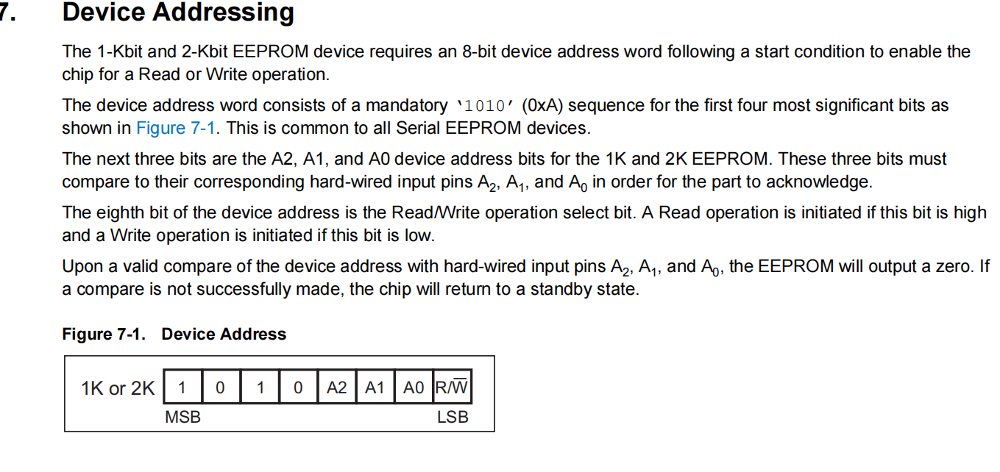
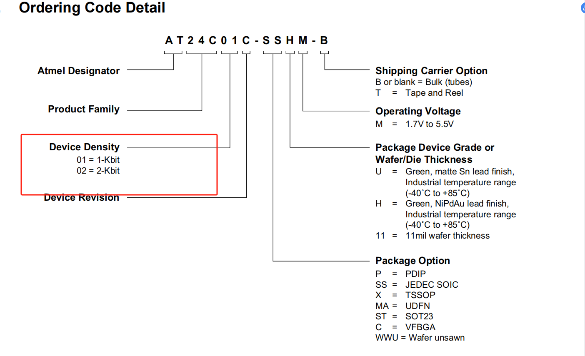
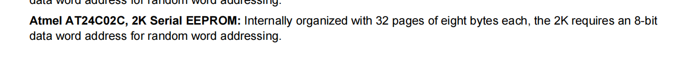

# I2C

1. ## 实验目的

   1. 实现I2C读写eeprom。

2. ## 实验思路

   1. 
      1. I2C PB6、PB7 A0,A1,A2全接地。本机从机地址为11100000（0x50）
      2. 
      3. 
      4. 
      5. eeprom容量为2Kb,有32页，每页8个字节。
      6. 写满32页，再读出来看是否与写的数据相同。
      7. 写的数据和读的数据用串口打印。

3. ## 实验步骤

   1. 串口初始化（时钟、管脚）
   2. I2C初始化（时钟初始化）
   3. 循环写256个字节到EEPROM
   4. 读256个字节从EEPROM
   5. 校验两者是否相同，不相同出来
   6. eeprom驱动：
      1. 写一字节、一页、缓冲区
      2. 读
      3. AT24C02C-SSHM-T  2Kb 32页 每页8个字节 8位地址地址寻址 256个字节

4. ## 总结

   1. 目前一字节读写无问题。下一步准备实现多字节读写。
      1. GD32单片机默认是从机模式， i2c_mode_addr_config形参是设置本机作为从机的地址。作为主机，向从机地址发送数据，此时设置从机地址是在发送函数，i2c_data_transmit
      2. 期间遇到过写之后立马读，发送从机地址后无ACK的情况，有两个原因。
         1. 这是因为eeprom有个Standby Mode，在收到停止信号后，马上进入低功耗模式。此时不会响应ACK。可以通过在写后延时5ms解决，验证无问题。
         2. 读一字节后，没有在发送从机地址并受到ACK时把ACK使能关闭，导致马上从机传输要读的数据时，主机还给了ACK，所以从机以为还要继续读数据然后总线未释放。
         3. 熟悉芯片手册。

